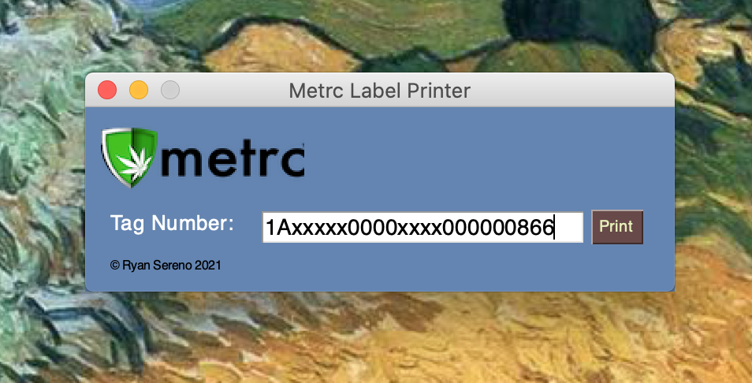
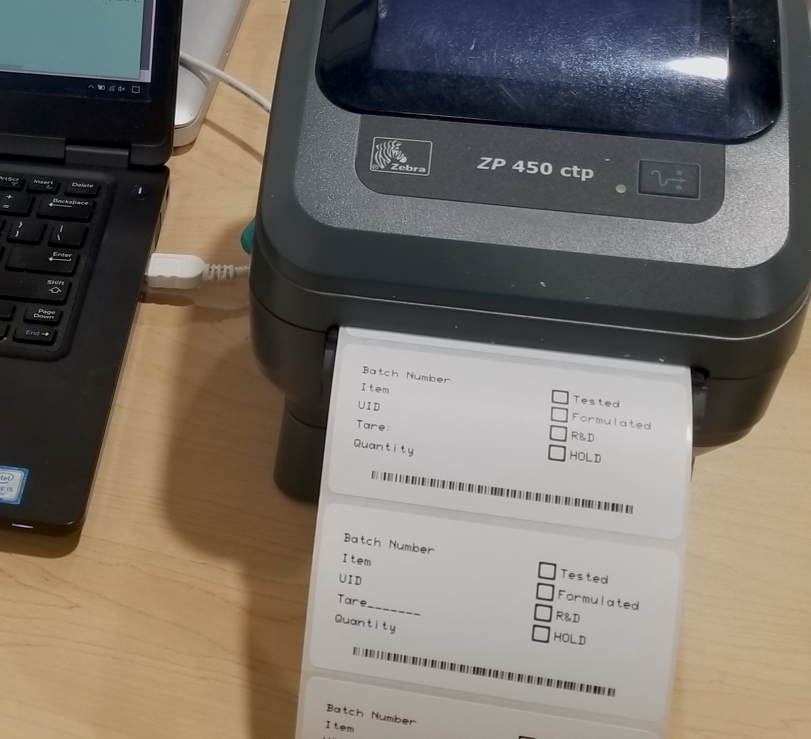

<h1><strong>Metrc Label Printer</strong></h1>

A simple widget that pulls data directly from Metrc and sends it to a thermal label printer.

<ul>
<li>Data is always up to date and accurate</li>
<li>Works with most zebra/ZPL compatible printers</li>
<li>Seamless integration with any barcode scanner</li>
</ul>

Due to Metrc's limits on api calls, you will need to apply for your own software key.

Insert your software key, user key, and license number into the code.

Setup your printer with your computer, either with its native drivers or a CUPS server; insert the name of your printer into the code.

Dependency libraries: PySimpleGUI, Zebra, and requests

&nbsp;

